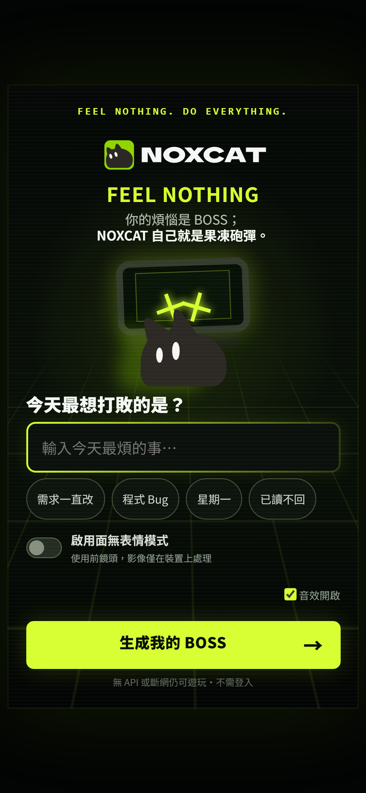
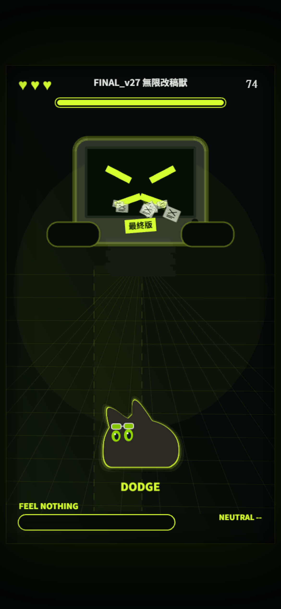
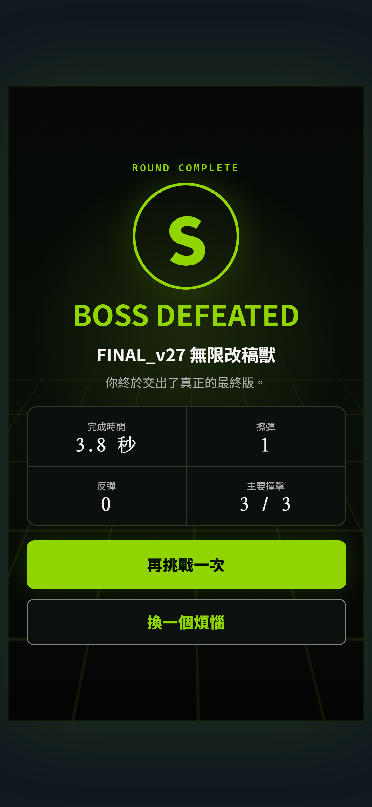
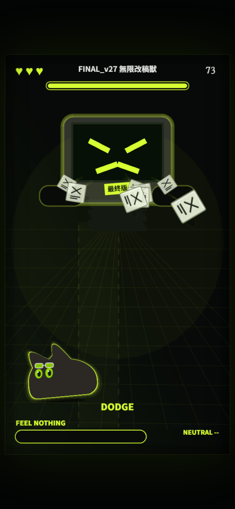
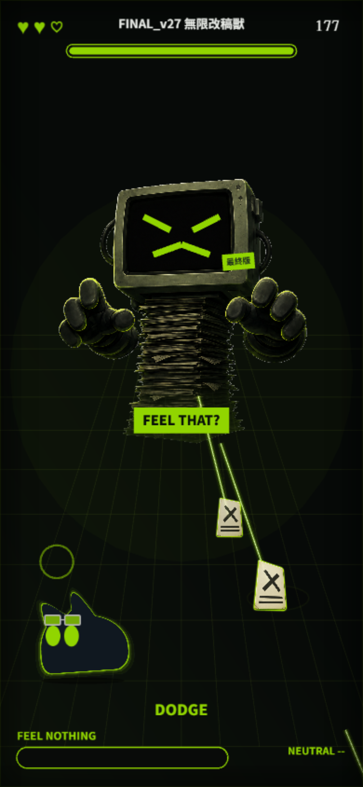
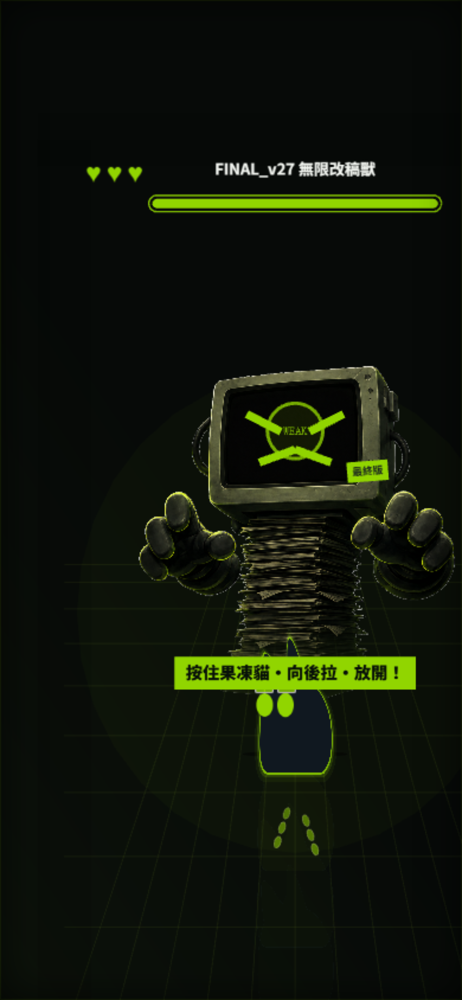

# NOXCAT: FEEL NOTHING

> 你的煩惱是 Boss；NOXCAT 自己就是果凍砲彈。

一款 75 秒、直式手機瀏覽器 Boss 戰。輸入今天最煩的事，伺服器會把它編譯成安全且可重現的 `BossDNA`；拖曳 NOXCAT 閃避文件、擦彈充滿 `FEEL NOTHING`，再向後拉伸並把果凍貓射向 Boss。

## Screenshots

| 開始頁 | 戰鬥 | 結果 |
| --- | --- | --- |
|  |  |  |

| 快速拖曳 | 放手回彈／液滴 | 果凍砲彈 |
| --- | --- | --- |
|  |  |  |

視覺以 `docs/mockups/` 的比例與動態方向為參考，並以主辦方官方素材包校正角色識別：charcoal 黑、螢光萊姆綠、CRT＋文件堆 Boss、低位平底紅豆麵包輪廓與極簡 HUD。開始頁使用未修改的官方 Logo；戰鬥角色使用依官方 Logo 比例重繪的平面 SVG。兩顆官方主綠 `#91D500` 發光大眼與額前綠鏡護目鏡、固定碰撞圓及三層貼合輪廓的萊姆綠光暈分層即時計算；一般拖曳不繪製長尾線，動感來自貓本體的壓縮、過衝與放手後回彈。只有主要發射才使用 8 個短殘影與 6 顆液滴；拖動、急轉、放手、發射、撞擊與落地共用 frame-rate-safe 彈簧。Boss 文件以 2.5D 消失點投影從遠景射入，逐步展開、放大、加深陰影，但碰撞半徑不隨視覺縮放改變。所有遊戲資產映射集中於 `AssetRegistry`，並保留載入失敗時的同輪廓程序化 fallback。

## 技術棧

- Node.js 22+、npm、TypeScript strict
- Phaser 3.90.0
- Vite 8 + Express 5，同一個 process／同源 API
- OpenAI JavaScript SDK + OpenAI-compatible v1 Chat Completions + Zod
- MediaPipe Face Landmarker（本地 model／WASM、Worker 推論）
- Vitest + Playwright（390×844 Android Chrome profile、iPhone WebKit profile）

## 安裝與啟動

需要 Node.js 22.12 以上；本專案開發驗證使用 Node 24.19。

```bash
npm install
cp .env.example .env
npm run fetch:face-model
npm run copy:mediapipe
npm run dev
```

開啟 `http://localhost:4173`。開發服務是單一 Express process；它掛載 Vite middleware 並同時提供 `/api/boss`。

Windows PowerShell 可用：

```powershell
Copy-Item .env.example .env
npm run dev
```

## 環境變數

```env
OPENAI_API_KEY=
OPENAI_MODEL=gpt-5-mini
OPENAI_BASE_URL=
OPENAI_INITIAL_PROMPT="Always use zh-Hant-TW Traditional Chinese for every player-facing text field. Never output Simplified Chinese. Make the boss verbose, witty, and unmistakably related to the user's annoyance."
OPENAI_TIMEOUT_MS=5500
PORT=4173
```

- AI 呼叫使用 OpenAI-compatible `POST /v1/chat/completions`。連接 OpenAI 時可將 `OPENAI_BASE_URL` 留空；連接本地 LLM 時填入服務的 v1 root，例如 `http://127.0.0.1:11434/v1`。
- 本地服務不要求驗證時可將 `OPENAI_API_KEY` 留空；只要有 `OPENAI_BASE_URL`，server 仍會呼叫本地模型。若服務要求 token，請正常填入 API key。
- 沒有 `OPENAI_API_KEY` 且沒有 `OPENAI_BASE_URL`、斷網、模型拒絕、非 2xx、無效 JSON/schema 或 API 超過 6 秒時，客戶端會立即使用本地 fallback Boss。
- API key 只由 Node server 讀取，不會進入前端 bundle、HTML 或 localStorage。
- `OPENAI_MODEL` 只在伺服器端設定；OpenAI 預設為 `gpt-5-mini`，本地服務請改成已載入的模型名稱。
- `OPENAI_INITIAL_PROMPT` 會放在固定安全規則之前，可用來補充本地模型指令；固定規則不會被取代。
- 所有 AI 產生的玩家可見文字都會在 server 端以 OpenCC 轉成台灣繁體，再次通過 `BossDNASchema` 後才回傳，因此不只依賴模型遵守提示詞。

例如 Ollama 的 OpenAI-compatible endpoint：

```env
OPENAI_BASE_URL=http://127.0.0.1:11434/v1
OPENAI_MODEL=qwen3:8b
OPENAI_API_KEY=
OPENAI_INITIAL_PROMPT="Always use zh-Hant-TW Traditional Chinese for every player-facing text field. Never output Simplified Chinese. Make the boss verbose, witty, and unmistakably related to the user's annoyance."
OPENAI_TIMEOUT_MS=5500
```

本地服務必須支援 Chat Completions 的 `response_format.type=json_schema`。模型輸出仍會在 server 端重新解析並通過 `BossDNASchema`，不合法時不會進入遊戲。

## 操作

- 手機：單指拖曳 NOXCAT；角色會停在手指上方，避免遮擋。
- 桌面：拖曳、方向鍵或 WASD。
- 每波先有 500–750ms 預警與亮線安全通道，接著只發射一組編隊；清場後保留 900–1100ms 空檔才開始下一波。
- 靠近彈幕但不碰到會擦彈充能；每顆彈幕只計一次。
- 帶空心框與旋轉箭頭的文件可在高速移動時撞回 Boss。
- 能量滿後，按住 NOXCAT、向想發射方向的反方向拉、放開。
- 三次主要撞擊（每次 34 傷害）即可勝利；時間到或生命歸零則失敗。

招式包含 `paper_rain`、`comment_crossfire`、`deadline_beam`、`closing_walls`、`revision_homing`、`returnable_burst`。BossDNA 的三段招式會依 seed 與順序循環至回合結束；戰鬥布局不使用 `Math.random()`。

AI BossDNA 另外包含 12 句針對玩家煩惱生成且互不重複的戰鬥碎念。生成分成兩個連續 API 呼叫，每批 6 句；loading 畫面會依實際批次完成狀態顯示 0%、50%、100%。戰鬥中約每 2.4 秒顯示一句，受傷、反彈、弱點開啟與主要撞擊時也會觸發。

## 相機與隱私

相機模式完全可選，不使用相機也能通關。

- 只有玩家在說明頁按下「開始 2 秒校正」後才呼叫 `getUserMedia`。
- 320×240 前鏡頭 frame 只傳入同頁 MediaPipe Worker；不會上傳、錄影或儲存。
- 只保留 Neutral 分數統計，不保留影像、landmarks 或 bitmap。
- Neutral 是可見的笑、張嘴、抬眉、睜眼動作之遊戲化分數，不代表心理狀態或真正情緒辨識。
- 無臉、拒絕權限、模型載入失敗或 Worker 失敗都不會阻擋遊戲。
- 離開戰鬥與重玩時會停止 MediaStreamTrack、worker 與 inference timer。
- Production 必須使用 HTTPS（localhost 開發除外）。

## 官方 NOXCAT 素材

開發者本機可將主辦方提供的官方素材包與 `NOXCAT IP_Usage Guidelines.pdf` 放在 `docs/official-assets-20260904/`；該目錄已列入 `.gitignore`，不屬於此 repo 的發布內容。開始頁使用未變形、未改色且不受掃描線覆蓋的官方白色 Logo；戰鬥角色依規範允許的「重製／姿勢與表情／遊戲資產化」條款，重繪成 `public/assets/ip/noxcat/noxcat-logo-bun-v5.svg`：比例約 1.1:1、兩耳集中於前半部、底部是一段清楚的水平平底，再以獨立平面圖層補上官方主綠大眼與額前綠鏡護目鏡，並由程式即時做果凍變形。

1. 官方 Logo 固定使用 `public/assets/ip/noxcat/noxcat-logo-official-white.png`，不旋轉、不改色、不加特效、不重新排字。
2. 戰鬥衍生角色、眼睛與 hit flash 經 `src/assets/AssetRegistry.ts` 統一載入；Scene 與系統沒有散落路徑。
3. 角色維持官方主黑貓形、尖耳、兩顆 `#91D500` 發光大眼、額前綠鏡護目鏡與綠色單一高彩度強調色。
4. 原始素材包不納入 Git；repo 內仍存在的 NOXCAT Logo、衍生角色與呈現圖不受本專案 GPL 授權。素材限本次黑客松使用；活動後若繼續公開、上架或商業化，須先取得 NOXCAT 書面同意。

戰鬥 SVG 是依官方 Logo 比例重繪的可動畫遊戲衍生角色，不宣稱為未修改的官方 Logo；開始頁 wordmark 才是原封不動的官方檔案。

## 授權

除明確排除的素材與第三方元件外，貢獻者擁有的原創程式碼與原創文件採 GNU GPL v3 only（`GPL-3.0-only`）授權。完整正文與適用範圍請見 `LICENSE` 與 `LICENSE-SCOPE.md`。

NOXCAT 名稱、商標、官方素材、可辨識衍生圖像、截圖與概念圖不在 GPL 授權範圍內；MediaPipe WASM 與 Face Landmarker 模型保留 Apache License 2.0，詳見 `THIRD_PARTY_NOTICES.md`。加入 GPL 並不代表取得公開散布 NOXCAT 素材的權利。

## 測試與 Build

```bash
npm run check
npm run test:e2e
npm run build
npm start
```

其他指令：

- `npm run test`：71 項 unit tests（schema、API 限制／fallback、RNG、Neutral、相機 lifecycle、combat、攻擊安全通道與波次、2.5D 投影、果凍彈簧跨 30／60／120 FPS 與回彈衰減、交付資產完整性）。
- `npm run test:e2e`：Android Chrome profile 的真實 canvas 拉弓、200ms 快速拖放與擦彈，攻擊 `TELEGRAPH → ACTIVE → RECOVERY`，iPhone WebKit profile state-machine smoke，合成相機的校正／Neutral 加成／抑制／無臉／完整清理，以及 API 失敗 fallback、無橫向溢出。
- `npm run capture:screenshots`：對目前 `http://127.0.0.1:4173` 產生開始、戰鬥、拖曳、回彈、發射與結果共六張手機截圖。
- `?debug=1`：FPS、狀態、hitbox、BossDNA 與操作控制。

Playwright 的 WebKit driver 無法合成 trusted touch-drag，因此 WebKit 的三擊 smoke 使用 development-only hook 走同一套 `AIMING → LAUNCHED → STAGGERED/WON` 狀態機；Chromium 測試會實際送出 canvas 觸控式 drag sequence。

## Production 部署

```bash
npm run build
PORT=4173 OPENAI_API_KEY=... npm start
```

部署平台需提供：

- Node.js 22.12+
- HTTPS（相機必要）
- 可寫入環境變數的 server runtime
- 同一網域提供 `dist/`、`public/` 靜態資產與 `/api/boss`

不需資料庫、登入、cookie 或跨網域 CORS。

## Progress

- [x] Gate 0：Vite／Express／Phaser 單一服務、540×960 responsive canvas、production build。
- [x] Gate 1：fallback 垂直切片、果凍彈簧拖曳、hit／graze／energy、三擊勝利、結果頁。
- [x] Gate 2：六種 deterministic pattern、分波預警／安全通道／清場空檔、2.5D 射入、反彈文件、75 秒失敗、音效、失焦暫停、debug、mobile E2E。
- [x] Gate 3：BossDNA Schema、OpenAI-compatible v1 Chat Completions Structured Outputs、可設定 local LLM base URL、rate limit、4 KB body、server/client 雙層 fallback。
- [x] Gate 4：明確同意、2 秒 median baseline、Worker 8–10 Hz、main-thread fallback、Neutral/EMA、完整清理。
- [ ] Gate 5：官方素材／指南整合、PWA meta、安全區、橫向暫停、固定 540×960 backing canvas（不乘上未受控的裝置 DPR）、低 FPS 殘影／液滴降級與 Android Chrome／iPhone WebKit profile 自動 QA 已完成；提交前仍需 Android Chrome、iPhone Safari 與實體相機人工驗收。

## 已知限制

- 戰鬥角色是依官方 Logo 輪廓重繪、供果凍變形使用的衍生遊戲資產；它不是未修改的官方 Logo。開始頁 wordmark 才是官方原檔。
- 自動化測試以合成、完全不開啟真實鏡頭的 frame 驗證相機成功、權限拒絕、略過、Neutral 加成／抑制、無臉與資源清理；實際光線、臉部角度與效能下的 Neutral 品質仍需在最終 Android／iPhone 真機校正。
- Phaser 主 bundle 約 1.3 MB（gzip 約 353 KB）；Face worker／vision bundle 已分離，只有選擇相機時才啟動推論。
- 沒有背景音樂；音效使用首次遊戲手勢後解鎖的 Web Audio 合成提示音。
