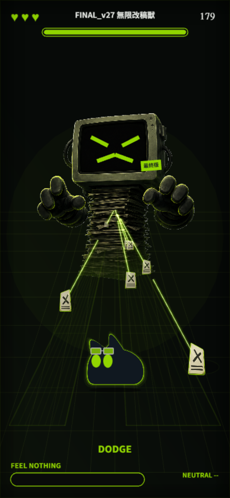
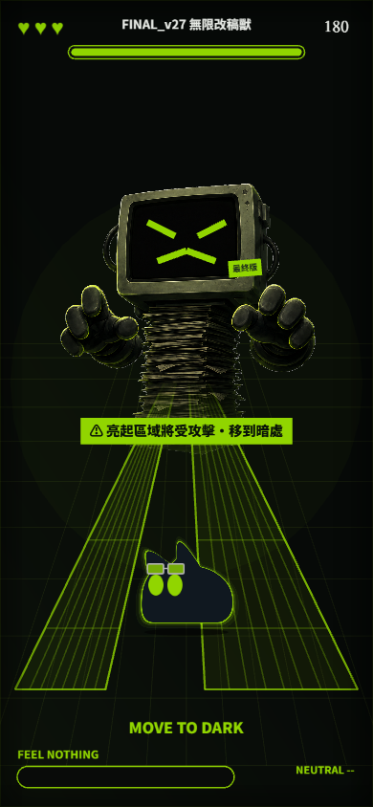
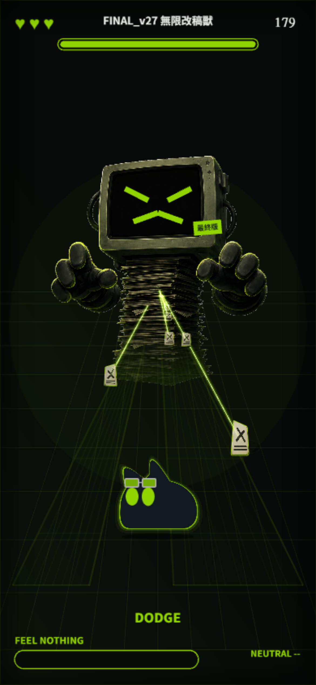
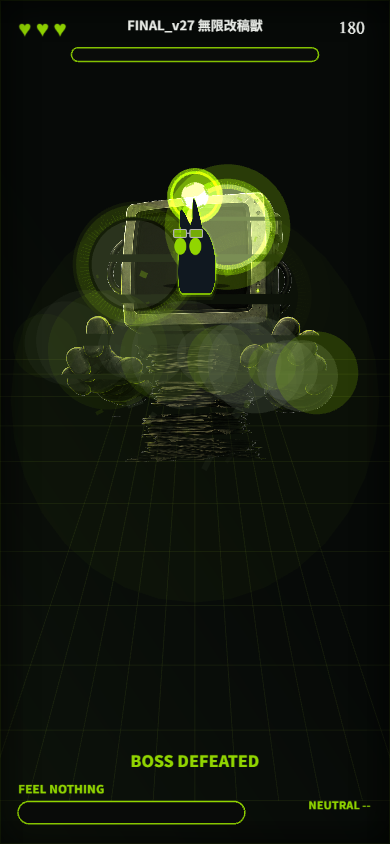

# NOXCAT: FEEL NOTHING

> 你的煩惱是 Boss；NOXCAT 自己就是果凍砲彈。

一款戰鬥倒數 180 秒、可提前擊敗 Boss 的直式手機瀏覽器 Boss 戰。輸入今天最煩的事，伺服器會把它編譯成安全且可重現的 `BossDNA`；拖曳 NOXCAT 閃避文件、擦彈充滿 `FEEL NOTHING`，再向後拉伸並把果凍貓射向 Boss。根目錄規格中原有的 75 秒設定已由最新需求取代。

## Screenshots

| 開始頁 | 戰鬥 | 結果 |
| --- | --- | --- |
|  |  |  |

| 快速拖曳 | 放手回彈／液滴 | 果凍砲彈 |
| --- | --- | --- |
|  |  |  |

| 攻擊危險區 | 共享消失點射入 | Boss 爆炸塌落 |
| --- | --- | --- |
|  |  |  |

視覺以 `docs/mockups/` 的比例與動態方向為參考，並以主辦方官方素材包校正角色識別：charcoal 黑、螢光萊姆綠、CRT＋文件堆 Boss、低位平底紅豆麵包輪廓與極簡 HUD。Boss 主體改用依使用者提供概念圖生成、再抽離為真透明背景的 `public/assets/boss/boss-office-base-v1.png`；CRT 表情、裂痕、弱點標籤、發光與命中回饋仍由遊戲即時疊加，因此既保留概念圖質感也能反映戰鬥狀態。最後一擊會先觸發全畫面爆光與震波，再把 Boss 拆成九層由底部開始失去支撐、依序下墜壓縮，搭配碎片與煙塵，完成後才進入結算。首頁亦重用同一張 Boss 圖作低透明灰階背景並向下淡出，不再放置舊 CSS 小螢幕或倒 V 光線。開始頁使用未修改的官方 Logo；戰鬥角色使用依官方 Logo 比例重繪的平面 SVG。兩顆乾淨的官方主綠 `#91D500` 單色橢圓大眼、可選配額前綠鏡護目鏡、固定碰撞圓及三層貼合輪廓的萊姆綠光暈以獨立圖層即時計算；首頁角色另以對稱的三層 drop shadow 沿整個輪廓發光。一般拖曳不繪製長尾線，動感來自貓本體的壓縮、過衝與放手後回彈。完整品質下，主要發射最多使用 8 個短殘影與 6 顆液滴；持續低於 45 FPS 時自動降為 5 個與 3 顆。文件不繪製綠色速度軸或拖尾，閒置 Mesh 使用 dirty cache，HUD／debug texture 只在內容變動或固定低頻率時重畫，viewport resize 亦合併到 animation frame，避免手機上逐物件與逐幀的重複成本。拖動、急轉、放手、發射、撞擊與落地共用 frame-rate-safe 彈簧。Boss 文件共用地板消失點；每張文件以 4×6 cells 的細分 WebGL Mesh 對整張剛性平面做 pinhole 投影，依自己的左右 lane 取得相反 yaw、依縱深取得 pitch，UV 不再沿兩個大型三角形的對角線折彎，速度也不會額外拉長紙面。一般文件與反彈文件分別使用生成後抽離成透明背景的 `paper-generated-v1.png` 與 `returnable-generated-v1.png`；近景基準降為 40×52 logical px，並同步縮小 Mesh 多邊形碰撞面。Boss 射出的文件會先完成左右 lane 的梯形透視校正，再把整張剛性紙面依 seeded RNG 以非零角速度隨機順時針或逆時針旋轉；碰撞四角使用相同的後旋轉矩陣。遠景不參與碰撞，進入近景時可見中心與實際文件四角精確交接，低 FPS 越界幀則使用 swept collision。近景文件延續各自透視入口的投影末端速度並向外加速，等完整卡面離開 padded viewport 後便逐張回收。攻擊預警、地板框線與 Boss 文件共用同一消失點及超出畫面左右的近端邊界；`comment_crossfire` 與 `closing_walls` 另從左右牆口的獨立消失點射入，`top_downpour` 則使用正上方的垂直入口。NOXCAT 往 Boss 方向移動時最低縮至 42%，精確輪廓碰撞同步採用該即時縮放。首頁、戰鬥與結束頁皆依 live visual viewport 填滿；手機判斷以尺寸和方向為準，不依賴不穩定的 pointer／hover 回報，並另有 iOS／Android standalone PWA fallback 與 safe-area padding。所有遊戲資產映射集中於 `AssetRegistry`，並只在素材載入失敗時使用隔離的程序化 fallback。

## 技術棧

- Node.js 22+、npm、TypeScript strict
- Phaser 3.90.0
- Vite 8 + Express 5，同一個 process／同源 API
- OpenAI JavaScript SDK + OpenAI-compatible v1 Chat Completions + Zod
- MediaPipe Face Landmarker（本地 model／WASM、Worker 推論）
- Vitest + Playwright（390×844 Android Chrome profile、iPhone WebKit profile）

## 安裝與啟動

需要 Node.js 22.12 以上；本專案開發驗證使用 Node 24.19。

```bash
npm install
cp .env.example .env
npm run fetch:face-model
npm run copy:mediapipe
npm run dev
```

開啟 `http://localhost:4173`。開發服務是單一 Express process；它掛載 Vite middleware 並同時提供 `/api/boss`。

Windows PowerShell 可用：

```powershell
Copy-Item .env.example .env
npm run dev
```

## 環境變數

```env
OPENAI_API_KEY=
OPENAI_MODEL=gpt-5-mini
OPENAI_BASE_URL=
OPENAI_INITIAL_PROMPT="Always use zh-Hant-TW Traditional Chinese for every player-facing text field. Never output Simplified Chinese. Make the boss verbose, witty, and unmistakably related to the user's annoyance."
OPENAI_TIMEOUT_MS=5500
PORT=4173
```

- AI 呼叫使用 OpenAI-compatible `POST /v1/chat/completions`。連接 OpenAI 時可將 `OPENAI_BASE_URL` 留空；連接本地 LLM 時填入服務的 v1 root，例如 `http://127.0.0.1:11434/v1`。
- 本地服務不要求驗證時可將 `OPENAI_API_KEY` 留空；只要有 `OPENAI_BASE_URL`，server 仍會呼叫本地模型。若服務要求 token，請正常填入 API key。
- 沒有 `OPENAI_API_KEY` 且沒有 `OPENAI_BASE_URL`、斷網、模型拒絕、非 2xx、無效 JSON/schema 或 API 超過 6 秒時，客戶端會立即使用本地 fallback Boss。
- API key 只由 Node server 讀取，不會進入前端 bundle、HTML 或 localStorage。
- `OPENAI_MODEL` 只在伺服器端設定；OpenAI 預設為 `gpt-5-mini`，本地服務請改成已載入的模型名稱。
- `OPENAI_INITIAL_PROMPT` 會放在固定安全規則之前，可用來補充本地模型指令；固定規則不會被取代。
- 所有 AI 產生的玩家可見文字都會在 server 端以 OpenCC 轉成台灣繁體，再次通過 `BossDNASchema` 後才回傳，因此不只依賴模型遵守提示詞。

例如 Ollama 的 OpenAI-compatible endpoint：

```env
OPENAI_BASE_URL=http://127.0.0.1:11434/v1
OPENAI_MODEL=qwen3:8b
OPENAI_API_KEY=
OPENAI_INITIAL_PROMPT="Always use zh-Hant-TW Traditional Chinese for every player-facing text field. Never output Simplified Chinese. Make the boss verbose, witty, and unmistakably related to the user's annoyance."
OPENAI_TIMEOUT_MS=5500
```

本地服務必須支援 Chat Completions 的 `response_format.type=json_schema`。模型輸出仍會在 server 端重新解析並通過 `BossDNASchema`，不合法時不會進入遊戲。

## 操作

- 手機：單指拖曳 NOXCAT；角色會停在手指上方，避免遮擋。
- 手機戰場會監聽 `visualViewport` 高度，在 Safari／Chrome 網址列展開、收合或旋轉時即時讓 canvas 填滿可見螢幕。540×960 是美術基準，實際相機使用單一等比 zoom 並在較長或較寬的裝置延伸可視世界；上下 HUD 錨定即時可視邊界，因此不會留下 letterbox 黑邊，也不會把角色與文件拉扁。
- 桌面：拖曳、方向鍵或 WASD。
- 額前護目鏡預設配戴，可在開始頁關閉；重玩與換一個煩惱會沿用目前選擇。
- 每波先有 500–750ms 透視危險區預警；亮起的斜紋梯形／錐形會受攻擊，暗處才是安全路徑；框內縱向斜線與地板格線共用 Boss 消失點，不使用固定角度貼圖。紙張雨的近端範圍延伸到左右畫面外，最左／最右站位也會被掃過；斜向留言與文件牆會真正從左右牆口交錯射入，並分別保留安全高度或緩慢移動的缺口。反彈波先射 3–4 張普通文件，1,250ms 時解除其傷害並讓它們各自高速飛離，隔 240ms 才在獨立路徑射出唯一一張深色綠框、環形箭頭文件，並保留至少 650ms 近景操作時間；綠色標記文件本身不會傷害玩家，只有高速碰撞才會將它反射。一般波結束後只保留 360–500ms recovery；彈幕提前清空時也會在最低可讀時間後立刻收尾，未離場卡片不會一起淡出。
- 靠近彈幕但不碰到會擦彈充能；每顆彈幕只計一次。
- 帶空心框與旋轉箭頭的文件可在高速移動時撞回 Boss。
- 能量滿後，按住 NOXCAT、向想發射方向的反方向拉、放開。
- 三次主要撞擊（每次 34 傷害）即可勝利；時間到或生命歸零則失敗。

招式包含 `paper_rain`、`comment_crossfire`、`deadline_beam`、`closing_walls`、`revision_homing`、`returnable_burst`、`top_downpour`、`pulse_barrage`、`alternating_zipper`。其中 `top_downpour` 使用畫面正上方的獨立垂直透視射線，`pulse_barrage` 以齊射與停頓形成節奏，`alternating_zipper` 則左右交替加速；三者皆保留可預讀的安全通道。開發版與正式版預設共用完整九招池，AI 成功或離線 fallback 都以 BossDNA seed 洗牌，每輪九招各出現一次，下一輪重新洗牌且不與上一輪最後一招重複。選招與彈幕布局使用獨立 RNG，因此同一 BossDNA 重玩會重現選招順序，玩家移動不會改變下一輪的招式順序。API 的 BossDNA 仍維持三段設定，遊戲保留這三招各自的強度與時間，其餘招式使用既有平衡預設；重複指定同一招時採第一筆。`?demo=all` 已無須使用；`?demo=off` 僅在開發版保留原始三段固定序列，供單招診斷與既有測試使用，正式版忽略此參數。戰鬥布局與選招都不使用 `Math.random()`。

AI BossDNA 另外包含 12 句針對玩家煩惱生成且互不重複的戰鬥碎念。生成分成兩個連續 API 呼叫，每批 6 句；loading 畫面會依實際批次完成狀態顯示 0%、50%、100%。戰鬥中約每 2.4 秒顯示一句，受傷、反彈、弱點開啟與主要撞擊時也會觸發。

## 相機與隱私

面無表情模式是每次產生 Boss 後的固定流程，首頁不提供關閉選項。遊戲仍會先顯示本機處理說明，只有玩家按下「開始 2 秒校正」才請求鏡頭權限；玩家可在說明頁略過，相機遭拒或不可用時也會自動進入標準模式並完成整局。

- 只有玩家在說明頁按下「開始 2 秒校正」後才呼叫 `getUserMedia`。
- 320×240 前鏡頭 frame 只傳入同頁 MediaPipe Worker；不會上傳、錄影或儲存。
- 只保留 Neutral 分數統計，不保留影像、landmarks 或 bitmap。
- Neutral 是可見的笑、張嘴、抬眉、睜眼動作之遊戲化分數，不代表心理狀態或真正情緒辨識。
- 無臉、拒絕權限、模型載入失敗或 Worker 失敗都不會阻擋遊戲。
- 離開戰鬥與重玩時會停止 MediaStreamTrack、worker 與 inference timer。
- Production 必須使用 HTTPS（localhost 開發除外）。

## 官方 NOXCAT 素材

開發者本機可將主辦方提供的官方素材包與 `NOXCAT IP_Usage Guidelines.pdf` 放在 `docs/official-assets-20260904/`；該目錄已列入 `.gitignore`，不屬於此 repo 的發布內容。開始頁使用未變形、未改色且不受掃描線覆蓋的官方白色 Logo；戰鬥角色依收到的 Usage Guidelines 所載「重製／姿勢與表情／遊戲資產化」方向，重繪成 `public/assets/ip/noxcat/noxcat-logo-bun-v5.svg`：比例約 1.1:1、兩耳集中於前半部、底部是一段清楚的水平平底，再以兩個獨立平面圖層補上官方主綠橢圓大眼與預設開啟的可選額前綠鏡護目鏡，並由程式即時做果凍變形。

收到的壓縮包沒有 Guidelines 明稱應隨附且衝突時優先適用的 `NOXCAT Asset Licence`。因此現有文件不足以證明最終提交、公開散布或活動後使用的完整權利；正式交付前必須向主辦方取得並審閱該授權文件。

1. 官方 Logo 固定使用 `public/assets/ip/noxcat/noxcat-logo-official-white.png`，不旋轉、不改色、不加特效、不重新排字。
2. 戰鬥衍生角色、眼睛、護目鏡與 hit flash 經 `src/assets/AssetRegistry.ts` 統一載入；Scene 與系統沒有散落路徑。
3. 角色維持官方主黑貓形、尖耳、兩顆 `#91D500` 發光大眼、額前綠鏡護目鏡與綠色單一高彩度強調色。
4. 原始素材包不納入 Git；repo 內仍存在的 NOXCAT Logo、衍生角色與呈現圖不受本專案 GPL 授權。素材限本次黑客松使用；活動後若繼續公開、上架或商業化，須先取得 NOXCAT 書面同意。
5. `public/assets/boss/boss-office-base-v1.png` 是依本專案概念圖生成的遊戲衍生美術，不是官方原始素材；其角色／品牌相關使用仍受相同的提交與公開散布權利確認限制。

戰鬥 SVG 是依官方 Logo 比例重繪的可動畫遊戲衍生角色，不宣稱為未修改的官方 Logo；開始頁 wordmark 才是原封不動的官方檔案。

## 授權

除明確排除的素材與第三方元件外，貢獻者擁有的原創程式碼與原創文件採 GNU GPL v3 only（`GPL-3.0-only`）授權。完整正文與適用範圍請見 `LICENSE` 與 `LICENSE-SCOPE.md`。

NOXCAT 名稱、商標、官方素材、可辨識衍生圖像、截圖與概念圖不在 GPL 授權範圍內；MediaPipe WASM 與 Face Landmarker 模型保留 Apache License 2.0，詳見 `THIRD_PARTY_NOTICES.md`。加入 GPL 並不代表取得公開散布 NOXCAT 素材的權利。

## 測試與 Build

```bash
npm run check
npm run test:e2e
npm run build
npm start
```

其他指令：

- `npm run test`：198 項 unit tests（schema、API 限制／fallback、RNG、Neutral、相機 lifecycle、combat、實際輪廓／近景交接／掃掠碰撞、可取消 pattern timeline、反彈獨立窗口、危險區／安全路徑與波次、九招洗牌與跨輪不重複、左右超掃覆蓋、正上方雨勢、齊射停頓、左右加速、側牆入口、細分 UV pinhole Mesh／3D 消失點投影、梯形後旋轉與碰撞同步、連續加速離場與個別回收、不同螢幕比例的等比相機與觸控座標換算、持續低 FPS 視覺降級、果凍彈簧跨 30／60／120 FPS 與回彈衰減、NOXCAT 視覺資產、首頁灰階 Boss、生成式文件與透明 PNG／載入失敗 fallback 完整性）。
- `npm run test:e2e`：依桌面／行動瀏覽器能力條件執行或略過。桌面 Chromium、390×844 Android Chrome profile 與 iPhone WebKit profile 都會在 API 失敗後，經 canvas 真實執行三次拉弓／放手／物理命中並完成 fallback 勝利；手機 profile 另驗證首頁、戰鬥與結束頁在 390×844／390×600 完整貼齊 live viewport、相機 X/Y zoom 相同、worldView 延伸正確，以及 resize 後沒有水平或垂直溢出；獨立案例會強制走 installed-PWA standalone fallback。測試也會透過 development-only hook 推進同一個 round-expiry 路徑，驗證 180 秒 `BOSS ESCAPED` 結算與兩條重玩流程；最後一擊另驗證九層 Boss 塌落演出確實先於結果頁。其餘涵蓋AI／fallback 預設九招洗牌順序、左右牆口實際進場、真實高速拖曳反彈、敵方紙張完成透視後的 seeded 雙向旋轉、遠景無碰撞、近景可見中心／碰撞中心一致、低 FPS handoff swept collision、兩張探針 `2 → 1 → 0` 個別加速離場、提早結束空白 ACTIVE、縮短 recovery、200ms 快速拖放、攻擊 `TELEGRAPH → ACTIVE → RECOVERY`、合成相機校正／Neutral 加成／抑制／無臉／完整清理、低 FPS 降級與真實 rAF cadence、暫停 Clock、鍵盤／讀屏語意、44px 觸控目標、橫向暫停與無版面溢出。
- 正式版伺服器 smoke test：`dist/` 首頁、生成式 Boss PNG 與 `/api/boss` 都由同一個 Express process 回傳 200；未設定 API key 時正確回傳三段攻擊的本地 fallback。
- 攻擊選招 dev/build 回歸：先啟動 `npm run dev` 與 `PORT=4175 npm start`，再執行 `~/.playwright-env/bin/python scripts/verify-attack-sequence.py`。此腳本以 Chromium 的桌面／手機尺寸、模擬 AI 回應與離線 fallback 比對三輪共 27 招，驗證九招完整、不連續重複、保留 AI 強度與時間、相同 seed 重播、不同 seed 變化，以及正式版忽略 `demo` 參數；不呼叫外部 AI API。
- `npm run capture:screenshots`：對目前 `http://127.0.0.1:4173` 產生開始、危險區、透視攻擊、戰鬥、拖曳、回彈、發射與結果手機截圖。
- `?debug=1`：FPS、狀態、hitbox、BossDNA 與操作控制。

Chromium mobile profile 使用觸控事件序列；Playwright WebKit 使用其可信任 pointer/mouse drag。兩條路徑都先經 Phaser canvas input，再由相同的 `AIMING → LAUNCHED → STAGGERED/WON` 物理流程判定命中，不直接修改 Boss HP。

## Production 部署

```bash
npm run build
PORT=4173 OPENAI_API_KEY=... npm start
```

部署平台需提供：

- Node.js 22.12+
- HTTPS（相機必要）
- 可寫入環境變數的 server runtime
- 同一網域提供 `dist/`、`public/` 靜態資產與 `/api/boss`

不需資料庫、登入、cookie 或跨網域 CORS。

HX370 production 與 GitHub Actions 自動部署的設定、驗證及復原方式請見
[`docs/DEPLOYMENT.md`](docs/DEPLOYMENT.md)。

## Progress

- [x] Gate 0：Vite／Express／Phaser 單一服務、以 540×960 為 authored world 並以等比延伸相機填滿 live viewport 的 responsive canvas、production build。
- [x] Gate 1：fallback 垂直切片、果凍彈簧拖曳、hit／graze／energy、三擊勝利、結果頁。
- [x] Gate 2：九種 deterministic pattern、左右超掃近端平面、Boss／側牆／正上方多入口透視射入、危險區預警／安全路徑／清場空檔、反彈文件、180 秒失敗、音效、失焦暫停、debug、mobile E2E。
- [x] Gate 3：BossDNA Schema、OpenAI-compatible v1 Chat Completions Structured Outputs、可設定 local LLM base URL、rate limit、4 KB body、server/client 雙層 fallback。
- [x] Gate 4：明確同意、2 秒 median baseline、Worker 8–10 Hz、main-thread fallback、Neutral/EMA、完整清理。
- [ ] Gate 5：官方素材／指南整合、PWA meta 與 standalone viewport fallback、首頁／戰鬥／結束頁全螢幕 resize、危險區／安全路徑、橫向暫停、維持原比例的延伸相機、低 FPS 視覺降級／批次繪製、Boss 九層爆炸塌落與 Android Chrome／iPhone WebKit profile 自動 QA 已完成；提交前仍需 Android Chrome、iPhone Safari 與實體相機人工驗收。

## 已知限制

- 戰鬥角色是依官方 Logo 輪廓重繪、供果凍變形使用的衍生遊戲資產；它不是未修改的官方 Logo。開始頁 wordmark 才是官方原檔。
- 收到的官方素材壓縮包缺少 Guidelines 所稱的 companion `NOXCAT Asset Licence`，在取得並審閱前不能宣稱已確認完整提交或公開散布權利。
- 指南將額前綠鏡護目鏡，以及含尾巴與四肢的黑貓輪廓列為核心識別；本遊戲依產品需求允許關閉護目鏡，並採用省略尾巴／四肢的 Logo 紅豆麵包輪廓。正式提交前應取得權利方對這兩項設計的書面確認。
- 此環境未設定 `OPENAI_API_KEY`；Structured Outputs、Zod 驗證、mock AI success 與實際 fallback 均已通過，但仍需在本機 `.env` 設定有效 key，確認真實 API 回傳 `source: ai` 並完整玩完一局。
- Playwright 的 Pixel 5／iPhone 13 是桌面端裝置 profile，不等同真 Android Chrome／iPhone Safari。真機觸控、safe-area、旋轉、音訊解鎖、切換分頁恢復、相機系統指示燈關閉、不同光線／角度與中階手機 55–60 FPS 仍需人工驗收。
- 自動化測試以合成、完全不開啟真實鏡頭的 frame 驗證相機成功、權限拒絕、略過、Neutral 加成／抑制、無臉與資源清理；它不等同實體相機驗收。
- 戰鬥倒數本身是 180 秒；加上 Boss 登場與結果轉場後，未提前結束的一局 wall-clock 會略超過 3 分鐘，與早期「單局 3 分鐘內」規格存在衝突。
- Phaser 主 bundle 約 1.37 MB（gzip 約 367 KB）；Face worker／vision bundle 已分離，只有在固定說明頁按下校正並授予相機權限後才啟動推論。
- 沒有背景音樂；音效使用首次遊戲手勢後解鎖的 Web Audio 合成提示音。
